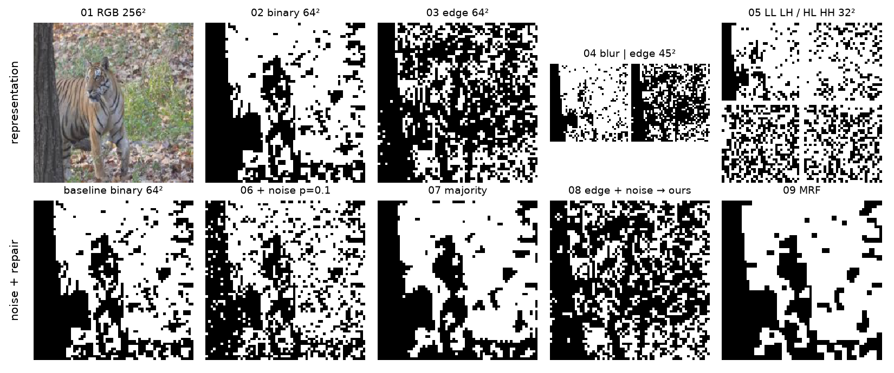
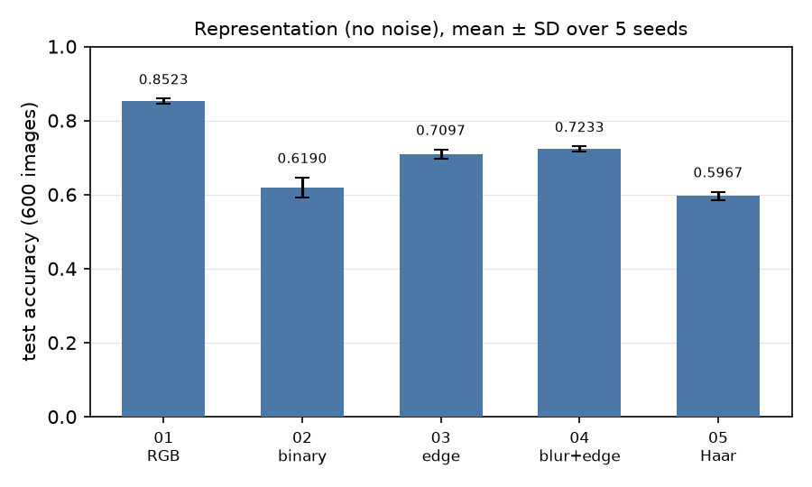
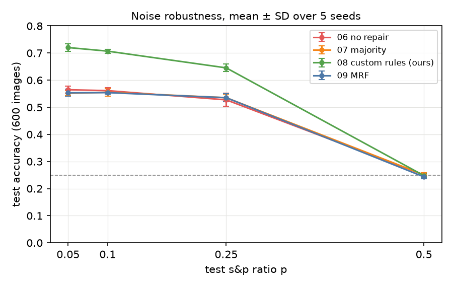

# 대역폭 제약 하의 강건한 이미지 분류

**기간:** 2025.05.12 – 2025.06.15

## 개요

4클래스 동물 이미지(Cat, Dog, Tiger, Zebra)를 ResNet-18로 분류한다. 전송량을 줄인 입력 표현(01–05)과
s&p 노이즈(픽셀 반전)를 섞은 64×64 이진 입력의 복원 방법(06–09)에 따라 정확도를 비교한다. 분류 실험(01–09)은
시드 5개(0–4)로 반복했다. 설정·정의와 전체 결과는 [`docs/experiment-log.md`](docs/experiment-log.md)(이하
로그)에 있다.

*윗줄: 01–05의 입력. 아랫줄: 노이즈 전 이진 입력과 06–09의 입력(노이즈 비율 0.1).*

| 실험 | 입력 | 노이즈 뒤 복원 |
| --- | --- | --- |
| 01 | RGB 256×256, 3채널 | – |
| 02 | 고정 임계값 이진 64×64, 1채널 | – |
| 03 | 에지 맵 이진 64×64, 1채널 | – |
| 04 | blur + 에지 이진 45×45, 2채널 | – |
| 05 | Haar 부대역 이진 32×32, 4채널 | – |
| 06 | 고정 임계값 이진 64×64 + 노이즈 | 없음 |
| 07 | 고정 임계값 이진 64×64 + 노이즈 | majority 필터 |
| 08 | 에지 맵 이진 64×64 + 노이즈 | 픽셀 규칙 (ours) |
| 09 | 고정 임계값 이진 64×64 + 노이즈 | MRF (Ising, ICM) |

## 결과

정확도는 50에폭 체크포인트를 Test 600장(클래스당 150장)으로 채점한 값이고, 시드 5개의 평균 ± 표준편차다.

### 입력 표현 (01–05, 노이즈 없음)

<table>
<tr>
<td>

| 실험 | 정확도 |
| :--- | ---: |
| 01 RGB | 0.8523 ± 0.0070 |
| 02 이진 | 0.6190 ± 0.0272 |
| 03 에지 | 0.7097 ± 0.0123 |
| 04 blur+에지 | 0.7233 ± 0.0071 |
| 05 Haar | 0.5967 ± 0.0112 |

</td>
<td></td>
</tr>
</table>

### 노이즈 강건성 (06–09)

*학습 때는 이미지마다 노이즈 비율을 {0.05, 0.1, 0.25, 0.5}에서 무작위로 고른다.*

| s&p 비율 | 06 복원 없음 | 07 majority | 08 픽셀 규칙 (ours) | 09 MRF |
| ---: | ---: | ---: | ---: | ---: |
| 0.05 | 0.5647 ± 0.0134 | 0.5513 ± 0.0092 | **0.7203 ± 0.0146** | 0.5533 ± 0.0130 |
| 0.1 | 0.5613 ± 0.0109 | 0.5553 ± 0.0143 | **0.7070 ± 0.0076** | 0.5540 ± 0.0056 |
| 0.25 | 0.5273 ± 0.0244 | 0.5353 ± 0.0123 | **0.6453 ± 0.0140** | 0.5353 ± 0.0151 |
| 0.5 | 0.2507 ± 0.0087 | 0.2510 ± 0.0080 | 0.2480 ± 0.0065 | 0.2433 ± 0.0064 |

- 08은 복원 방법뿐 아니라 이진화도 에지 맵(03과 같음)을 쓴다.
- 비율 0.5에서는 네 방법 모두 0.2433–0.2510이다. 한 클래스만 고르면 0.25다.

## 기타

- 학습된 체크포인트(각 실험의 시드 0, 50에폭)는 [Releases](https://github.com/donghyeoni/robust-image-classification/releases)에 있다.
- 픽셀 복원 오류율과 루프·벡터 연산 시간 비교는 [로그](docs/experiment-log.md)에 있다.
